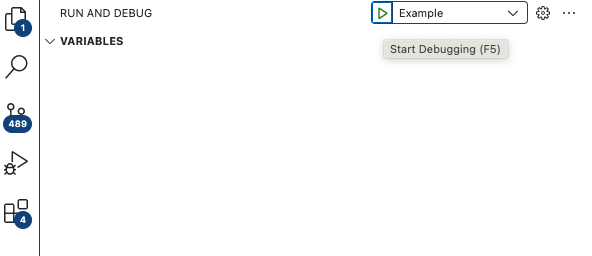

# debugging-ts-node

## launch.json and tsconfig.json that lets me debug .ts files

I was trying to debug a typescript file. Until today, I would generally just add a .ts file to a create-react-app project, import that file into
a react component and debug it in Chrome.

Now I can just use the debugger in vs.code and not be annoyed by the fact that my script runs twice in dev mode.



Thanks to Cecille Muller for (this gist)[https://gist.github.com/cecilemuller/2963155d0f249c1544289b78a1cdd695], but for me: running it in an empty folder with a .ts file, resulted in:

```
/usr/local/bin/node --nolazy -r ts-node/register/transpile-only driver.ts
Process exited with code 1
/Users/me/my-project/node_modules/ts-node/src/index.ts:859
    return new TSError(diagnosticText, diagnosticCodes, diagnostics);
           ^
TSError: ⨯ Unable to compile TypeScript:
error TS5109: Option 'moduleResolution' must be set to 'NodeNext' (or left unspecified) when option 'module' is set to 'NodeNext'.

    at createTSError (/Users/me/my-project/node_modules/ts-node/src/index.ts:859:12)
    at reportTSError (/Users/me/my-project/node_modules/ts-node/src/index.ts:863:19)
    at /Users/me/my-project/node_modules/ts-node/src/index.ts:1379:34
    at Object.compile (/Users/me/my-project/node_modules/ts-node/src/index.ts:1451:13)
    ...
}

```

So I added the very minimal `tsconfig.json` you see in this project, and now I can hit a breakpoint.
